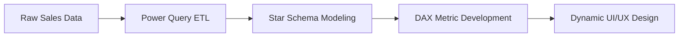

# 🛒 Superstore Executive Analytics Dashboard

  

  
  
  
  

---

## 🖼️ Dashboard Showcase

  

---

## 📌 Project Architecture
This project demonstrates a complete end-to-end data analytics workflow using **Microsoft Excel** as a powerful Business Intelligence tool, applying concepts typically used in enterprise BI solutions like Power BI.

---

## 🛠️ The Technical Stack

<b>🔹 1. Data Engineering (Power Query)</b>

 
<ul>
  <li>Standardized transactional datasets with millions of records.</li>
  <li>Built robust ETL pipelines to handle geographic normalization.</li>
  <li>Automated data refreshing via structured table connections.</li>
</ul>

<b>🔹 2. Star Schema Design (Power Pivot)</b>

 
<ul>
  <li>Developed a high-performance relational model.</li>
  <li>Separated <b>Fact Sales</b> from <b>Dimension Tables</b> (Products, Customers, Geography, Calendar).</li>
  <li>Ensured lightning-fast filtering across multi-year data.</li>
</ul>

<b>🔹 3. Analytical Intelligence (DAX)</b>

 
Developed custom measures for executive KPIs:
<ul>
  <li><b>Dynamic Ranking:</b> Top 10 products/customers by profit.</li>
  <li><b>Shipping Status:</b> Tracking efficiency vs. segment performance.</li>
  <li><b>Category Contribution:</b> Percentage-based revenue mix.</li>
</ul>

---

## 📊 Business Insights
*   **💻 Tech Dominance:** The Technology category accounts for the largest revenue share, but Office Supplies show higher stability in specific regions.
*   **📦 Logistics Impact:** Identified a direct correlation between shipping delays and lower performance in the "Corporate" segment.
*   **🌍 Regional Optimization:** Specific "Profit Deserts" were identified where sales are high but margins are negative due to logistics costs.

---

## 👤 Author
**Mohamed Salah Abdelhamid**
*   LinkedIn: [mohamedsalah-abdelhamid](https://www.linkedin.com/in/mohamedsalah-abdelhamid/)
*   GitHub: [@mohamedsalahabdelhamid](https://github.com/mohamedsalahabdelhamid)

---

  Mastering Retail Analytics through Business Intelligence 🛒

